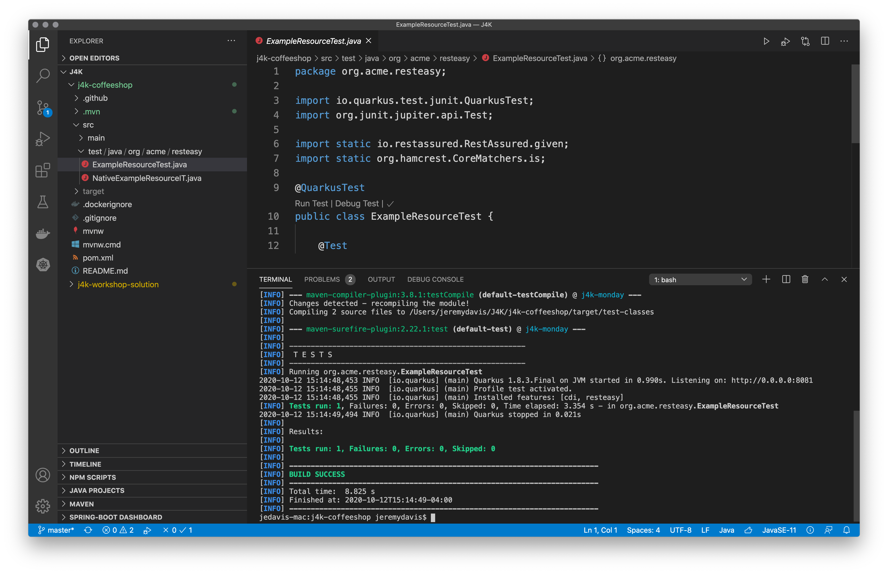

**Event Driven Architecture with Quarkus, Kafka, and Kubernetets**  

# Step 1 - Getting Started with Quarkus

In this workshop you will build a microservice to integrate the existing Quarkus Coffeeshop application with the FavFood Delivery Service

## Table of Contents

1. Workshop Overview (what you're going to build)
1. Getting Started with Quarkus
	1. Creating a project at https://code.quarkus.io
	1. Importing the project into Visual Studio Code
	1. Getting Started with the project
		1. Importing the project into Visual Studio Code
		1. Testing Quarkus applications
	1. Quarkus dev mode
    	1. Live changes
    	1. Configuration and Parameterizing the Greeting Message

## Workshop Overview

Because to go orders have recently taken on a new importance :mask: the Quarkus Coffeeshop business team has recently inked a deal with FavFood Delivery.  FavFood requires us, the Quarkus Coffeeshop dev team, to implement a REST endpoint for them to call with to go orders.

In this workshop we will consume their JSON format, translate it into our expected format, and enter it into the Quarkus Coffeeshop system.  Along the way we will learn how to:
* Quickly create a Quarkus application
* About Quarkus extensions
* Running Quarkus in dev mode (developer joy!)
* Reactive messaging with SmallRye reactive messaging
* Making REST calls


## Getting Started with Quarkus

### Creating a Project with https://code.quarkus.io

* Open https://code.quarkus.io
* In the top left corner set the values for your microservice:
  * org.j4k.workshops.quarkus
  * quarkus-coffeeshop-workshop
  * Maven (Quarkus supports Gradle as well, but this tutorial is built with Maven )
* From the menu select 
  * RESTEasy JAX-RS
  * RESTEasy JSON-B
  * REST Client JSON-B
* Click `"Generate Your Application"` and `Push to Github`
* Clone the repository on your filesystem


#### Importing the project into Visual Studio Code

If you followed the getting started recommendations on the [front page](README.md) you have a folder named "J4K" with the workshop solution already in it.  Clone your new application into the same directory so that you can easily refer to the solution.


*NOTE* Feel free to use any IDE that you like!  Your humble workshop authors favor IntelliJ Idea, but we have used Visual Studio Code for the screenshots and instructions because it is nice, free, and our Red Hat colleagues wrote the Java integration

* Open Visual Studio Code
* Open your existing workspace
* Click, "Git Clone"
* Enter the URL from your github repo

##### pom.xml

The selections you made at https://code.quarkus.io are in the pom.xml :

```xml
  <dependencies>
    <dependency>
      <groupId>io.quarkus</groupId>
      <artifactId>quarkus-resteasy</artifactId>
    </dependency>
    <dependency>
      <groupId>io.quarkus</groupId>
      <artifactId>quarkus-resteasy-jsonb</artifactId>
    </dependency>
    <dependency>
      <groupId>io.quarkus</groupId>
      <artifactId>quarkus-rest-client-jsonb</artifactId>
    </dependency>
```


For more on [Quarkus extensions](https://quarkus.io/guides/writing-extensions)


#### Testing Quarkus Applications

* Open `src/test/java/org/j4k/workshops/quarkus/ExampleResourceTest` 
* There are 2 ways to run tests from within VSCode:  
  * Click `"Run Test,"` which can be found under the `@Test` annotation and above the `"ExampleResourceTest"` method  

  

**Open a Terminal and type the following:**

```shell
./mvnw clean test
```  

There is a terminal located in Visual Studio Code (see screenshot below.)  Make sure you change into the directory of the new project after opening it.  




#### Quarkus Tests

You have probably noticed that the test classes are annotated with "@QuarkusTest."  The test spins up an instance of Quarkus, calls the endpoint using rest-assured, and verifies the output using [Rest-Assured](https://rest-assured.io)  

 :sunglasses: *DEV TIP:* [Rest-Assured](https://rest-assured.io)  is a *seriously* useful testing library.  We are also using the [Hamcrest](http://hamcrest.org/JavaHamcrest/) matchers, which is also an incredibly useful project.  If you haven't spent time with it before carve out some cycles to check them out: [https://rest-assured.io](https://rest-assured.io) and [Hamcrest](http://hamcrest.org/JavaHamcrest/)

### Dev Mode

"quarkus:dev runs Quarkus in development mode. This enables hot deployment with background compilation, which means that when you modify your Java files and/or your resource files and refresh your browser, these changes will automatically take effect. This works too for resource files like the configuration property file. 

Refreshing the browser triggers a scan of the workspace, and if any changes are detected, the Java files are recompiled and the application is redeployed; your request is then serviced by the redeployed application. If there are any issues with compilation or deployment an error page will let you know.

This will also listen for a debugger on port 5005. If you want to wait for the debugger to attach before running you can pass -Dsuspend on the command line. If you don’t want the debugger at all you can use -Ddebug=false."

https://quarkus.io/guides/getting-started#development-mode

:sunglasses: *Q-TIP* : when running multiple intances of Quarkus locally, which is pretty common in a microservices architecture you can have each one listen for a debugger on different ports.  For example when working the the Quarkus Coffeeshop your humble workshop authors typically assign the ports:
* web "-Ddebug=5005"
* core "-Ddebug=5006"
* barista "-Ddebug=5007"


Start Quarkus in dev mode from the Terminal in VS Code or from a terminal window on your machine:

```shell

./mvnw clean compile quarkus:dev

```  

Open http://localhost:8080 and http://localhost:8080/resteasy/hello

##### Live changes

Open the ExampleResource class (org.j4k.workshops.quarkus.ExampleResource.java.  This class was generated when we created our application.  It doesn't do much.  We will fix that.

Change the message from "hello" to something more prosaic, like "hello, world!" and save the file.  Now reload your browser.

The change is almost instantaneous.  

Change the message again to something even better, like, "hello, j4k!" and reload your browser.  Play around until you have a hello message you like

Quarkus Code Wisdom: *Coding is mostly trial and error.  The faster your feedback loop the more productive you will be!*

Once you're happy with the message, and your test are passing you can commit your code.  Of course the tests aren't going to pass no that we've changed the message

###### Some More Testing

You can run the test again without stopping Quarkus.  The tests use a different port so you can keep Quarkus runing in dev mode and run tests at the same time so we can fail our test while the app is running

##### Configuration and Parameterizing the Greeting Message

Let's parameterize the message by moving it into the application.properties file found in src/main/resources by adding the following:

```properties
# Configuration file
# key = value

%dev.hello.message=Hello, J4K 2020!
%test.hello.message=hello
hello.message=Hello from Quarkus!
```

As an astute developer you will have noticed that the properties are parameterized ("%dev.hello.message".)  You can add "%prod" if you like, but Quarkus will grab the non-parameterized property for prod by default.  

##### Update ExampleResource

Now we need to update ExampleResource.java to use the parameter:

```java
package org.j4k.workshops.quarkus;


import org.eclipse.microprofile.config.inject.ConfigProperty;
import javax.ws.rs.GET;
import javax.ws.rs.Path;
import javax.ws.rs.Produces;
import javax.ws.rs.core.MediaType;

@Path("/resteasy/hello")
public class ExampleResource {


    @ConfigProperty(name="hello.message")
    String helloMessage;

    @GET
    @Produces(MediaType.TEXT_PLAIN)
    public String hello() {
        return helloMessage;
    }
```

Refresh your browser.  You should of course see the new %dev.hello.message.

Re-run the test, and this time you should pass.  You can also parameterize the ExampleResourceTest.java:

```java
package org.j4k.workshops.quarkus;

import io.quarkus.test.junit.QuarkusTest;
import org.junit.jupiter.api.Test;

import static io.restassured.RestAssured.given;
import static org.hamcrest.CoreMatchers.is;

import javax.resource.spi.ConfigProperty;

@QuarkusTest
public class ExampleResourceTest {

    @ConfigProperty(name="hello.message")
    String helloMessage;

    @Test
    public void testHelloEndpoint() {
        given()
          .when().get("/resteasy/hello")
          .then()
             .statusCode(200)
             .body(is(helloMessage));
    }

}
```


You can commit the changes to github if you want:

```shell script
git commmit -am "Parameterized ExampleResource message"
```

And that's it for part 1!

In [Step 02](WORKSHOP-LOCAL-02-REST.md) you will integrate a third party API with the existing application using the Microprofile REST Client: [Onward!](WORKSHOP-LOCAL-02-REST.md)
