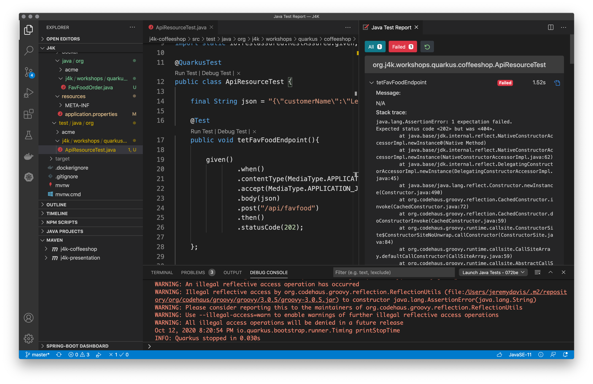

**Event Driven Architecture with Quarkus, Kafka, and Kubernetets**  

# Step 2 - Integration with the Microprofile REST Client

In this workshop you will build a microservice to integrate the existing Quarkus Coffeeshop application with the FavFood Delivery Service

## Table of Contents

1. Starting on Our Application
    1. Background and Requirements
    1. Setting up Logging
    1. Test First and Fail Fast
    1. Implement Our Endpoint
    1. The FavFood Domain Model
1. Getting the FavFood Order into Our Format
    1. Our Domain
    1. @RegisterForReflection    


## Starting on Our Application

### Background and Requirements

#### Background

Because to go orders have recently taken on a new importance :mask: the Quarkus Coffeeshop business team has recently inked a deal with FavFood Delivery.  FavFood requires us, the Quarkus Coffeeshop dev team, to implement a REST endpoint for them to call with to go orders.

In this workshop we will consume their JSON format, translate it into our expected format, and enter it into the Quarkus Coffeeshop system.  Along the way we will learn how to:
* Quickly create a Quarkus application
* About Quarkus extensions
* Running Quarkus in dev mode (developer joy!)
* Reactive messaging with SmallRye reactive messaging
* Making REST calls

#### Requirements

FavFood has supplied us with an [OpenApi](https://www.openapis.org/) document describing the service that we need to stand up in order to integrate with them.  Don't worry if you are unfamiliar with the OpenAPI spec, but it is worth checking out after the workshop: [SwaggerIO OpenAPI Specification](https://swagger.io/specification/)

```yaml
---
openapi: 3.0.1
info:
  title: FavFood Delivery Service API
  version: "1.0"
paths:
  /api:
    post:
      responses:
        "202":
          description: OK
          content:
            'application/json':
              schema:
                $ref: '#/components/schemas/Order'
components:
  schemas:
    Order:
      type: object
      properties:
        customerName:
          type: string
        orderId:
          type: string
        favFoodLineItems:
          $ref: '#/components/schemas/ListLineItem'
    ListLineItem:
      type: array
      items:
        $ref: '#/components/schemas/LineItem'
    LineItem:
      type: object
      properties:
        item:
          type: string
        itemId:
          type: string
        quantity:
          format: int32
          type: integer
```

We need to accept an "Order" object with properties, "customerName," "id," and an array "listLineItems" of "LineIem" objects defined.  The "LineItem" contains Strings for "itemId," "item," and an integer "quantity."


### Setting up Logging

Your humble workshop authors hate using System.out.println so we will start by configuring logging.

Add the following to your application.properties file:

```properties
# Logging
#quarkus.log.console.format=%d{HH:mm:ss} %-5p [%c{2.}] (%t) %s%e%n
quarkus.log.console.format=%-5p [%c{2.}] (%t) %s%e%n
quarkus.log.level=INFO
quarkus.log.category."org.j4k".level=DEBUG
quarkus.log.category."org.apache.kafka".level=FATAL
quarkus.log.category."org.testcontainers".level=FATAL
```

### Test First  and Fail Fast

Let's create a new package, "org.j4k.workshops.quarkus.coffeeshop"

:sunglasses: *IDE TIP* In Visual Studio Code you can add all of the folders that make up a package at the same time by including the slashes; "org/j4k/workshops/quarkus/infrastructure" and below:


Now add a test, "ApiResourceTest" for our REST service:

```java
package org.j4k.workshops.quarkus.coffeeshop;

import io.quarkus.test.common.QuarkusTestResource;
import io.quarkus.test.junit.QuarkusTest;
import org.junit.jupiter.api.Test;

import javax.ws.rs.core.MediaType;

import static io.restassured.RestAssured.given;

@QuarkusTest 
public class ApiResourceTest {

    final String json = "{\"customerName\":\"Lemmy\",\"orderId\":\"cdc07f8d-698e-43d9-8cd7-095dccace575\",\"favFoodLineItems\":[{\"item\":\"COFFEE_BLACK\",\"itemId\":\"0eb0f0e6-d071-464e-8624-23195c8f9e37\",\"quantity\":1}]}";

    @Test
    public void tetFavFoodEndpoint(){

        given()
                .when()
                .contentType(MediaType.APPLICATION_JSON)
                .accept(MediaType.APPLICATION_JSON)
                .body(json)
                .post("/api/favfood")
                .then()
                .statusCode(202);

    };


}
```  
#### Rest Assured Test

[Rest Assured](https://rest-assured.io/) is a great testing tool, which is why Quarkus includes it with the [RESTEasy](https://resteasy.github.io/) extension.  

:nerd_face: *TRIVIA* [RESTEasy](https://resteasy.github.io/) is one of the oldest Java REST frameworks

:sunglasses: *DEV TIP:* We are also using the [Hamcrest](http://hamcrest.org/JavaHamcrest/) matchers.  If you aren't familiar with these projects your humble workshop authors highly recommend you carve out some time to familiarize yourself with them.  Even if you are familiar with them it can be worth your time to revisit the docs; they are both great projects!

The Rest-Assured part of our test is:

```java
        given()
          .accept(MediaType.APPLICATION_JSON)
          .contentType(MediaType.APPLICATION_JSON)
          .body(order.toString())
          .when()
          .post("/FavFood")
          .then()
             .statusCode(202)
             .body("orderId", equalTo("cdc07f8d-698e-43d9-8cd7-095dccace575"))
             .body("customerName", equalTo("Lemmy"));
```

Most of it is similar to our earlier test.  The differences are that we have added header information and a body to the POST request.

#### Run the Test

Run the test.  It should of course fail because we haven't implemented our endpoint yet.

:guitar: *IRRELEVENT NOTE:* Black Coffee seems an appropriate beverage for Lemmy Kilminster who was the bassist, singer, and leader of Mötorhead until his death in 2015.  Your humble workshop authors chose Lemmy as our customer because Mötorhead is excellent background music for creating workshops.  Feel free to substitute a musician of your choosing.



### Implement Our Endpoint

Create the "org.j4k.workshops.quarkus.coffeeshop.infrastructure" package in the "src/java" folder.  Create a Java class, "org.j4k.workshops.quarkus.coffeeshop.infrastructure.ApiResource" with the following content:

```java
package org.j4k.workshops.quarkus.infrastructure;

import javax.ws.rs.POST;
import javax.ws.rs.Path;
import javax.ws.rs.core.Response;

import org.j4k.workshops.quarkus.favfood.domain.FavFoodOrder;

@Path("/api")
public class ApiResource {

    @POST
	@Path("/favfood)
    public Response placeOrder(final FavFoodOrder favFoodOrder){
        return Response.accepted().entity(favFoodOrder).build();
    }
}
```

Our class won't compile of course because FavFoodOrder doesn't exist.  Your humble workshop authors prefer to code the desired functionality and fill in the blanks with the missing code.  Not everybody enjoys this approach, and you could certainly start by creating the model.  We'll do that in the next step.

### Create the FavFood domain model

#### FavFoodOrder

Create a package for our FavFood domain objects in "org.j4k.workshops.quarkus.coffeeshop.favfood.domain"

Create a class, "FavFoodOrder," in the package:

```java
package org.j4k.workshops.quarkus.favfood.domain;

import java.util.List;

import io.quarkus.runtime.annotations.RegisterForReflection;

@RegisterForReflection
public class FavFoodOrder {

    String orderId;

    String customerName;

    List<FavFoodLineItem> favFoodLineItems;

    public FavFoodOrder(){

    }

}
```

Use your IDE to generate equals(), hashCode(), toString(), and getters and setters.  In Visual Studio Code you can right-click on the class, choose "Source Action," and you will get a menu with the options.

The whole class is below for reference:

```java
package org.j4k.workshops.quarkus.favfood.domain;

import java.util.List;

import io.quarkus.runtime.annotations.RegisterForReflection;

@RegisterForReflection
public class FavFoodOrder {

    String orderId;

    String customerName;

    List<FavFoodLineItem> favFoodLineItems;

    public FavFoodOrder(){

	}

	/**
	 * @param orderId
	 * @param customerName
	 * @param favFoodLineItems
	 */
	public FavFoodOrder(String orderId, String customerName, List<FavFoodLineItem> favFoodLineItems) {
		this.orderId = orderId;
		this.customerName = customerName;
		this.favFoodLineItems = favFoodLineItems;
	}

	/* (non-Javadoc)
	 * @see java.lang.Object#toString()
	 */
	
	@Override
	public String toString() {
		return "FavFoodOrder [customerName=" + customerName + ", favFoodLineItems=" + favFoodLineItems + ", orderId="
				+ orderId + "]";
	}

	/* (non-Javadoc)
	 * @see java.lang.Object#hashCode()
	 */
	
	@Override
	public int hashCode() {
		final int prime = 31;
		int result = 1;
		result = prime * result + ((customerName == null) ? 0 : customerName.hashCode());
		result = prime * result + ((favFoodLineItems == null) ? 0 : favFoodLineItems.hashCode());
		result = prime * result + ((orderId == null) ? 0 : orderId.hashCode());
		return result;
	}

	/* (non-Javadoc)
	 * @see java.lang.Object#equals(java.lang.Object)
	 */
	
	@Override
	public boolean equals(Object obj) {
		if (this == obj)
			return true;
		if (obj == null)
			return false;
		if (getClass() != obj.getClass())
			return false;
		FavFoodOrder other = (FavFoodOrder) obj;
		if (customerName == null) {
			if (other.customerName != null)
				return false;
		} else if (!customerName.equals(other.customerName))
			return false;
		if (favFoodLineItems == null) {
			if (other.favFoodLineItems != null)
				return false;
		} else if (!favFoodLineItems.equals(other.favFoodLineItems))
			return false;
		if (orderId == null) {
			if (other.orderId != null)
				return false;
		} else if (!orderId.equals(other.orderId))
			return false;
		return true;
	}

	/**
	 * @return the orderId
	 */
	public String getOrderId() {
		return orderId;
	}

	/**
	 * @param orderId the orderId to set
	 */
	public void setOrderId(String orderId) {
		this.orderId = orderId;
	}

	/**
	 * @return the customerName
	 */
	public String getCustomerName() {
		return customerName;
	}

	/**
	 * @param customerName the customerName to set
	 */
	public void setCustomerName(String customerName) {
		this.customerName = customerName;
	}

	/**
	 * @return the favFoodLineItems
	 */
	public List<FavFoodLineItem> getFavFoodLineItems() {
		return favFoodLineItems;
	}

	/**
	 * @param favFoodLineItems the favFoodLineItems to set
	 */
	public void setFavFoodLineItems(List<FavFoodLineItem> favFoodLineItems) {
		this.favFoodLineItems = favFoodLineItems;
	}
	
	
}
```

Your IDE should be complaining at this point because we don't have a "LineItem" class yet.  Let's fix that!

#### LineItem

Just like the FavFoodOrder create a class, "LineItem," in the "domain package":

```java

package org.j4k.workshops.quarkus.favfood.domain;

import io.quarkus.runtime.annotations.RegisterForReflection;

@RegisterForReflection
public class FavFoodLineItem {

    String itemId;

    String item;

    int quantity;

    public FavFoodLineItem(){

    }

}
```

Repeat the code generation steps above for getters and settes, hashCode(), equals(), and toString() so that you have a class like:

```java
package org.j4k.workshops.quarkus.favfood.domain;

public class FavFoodLineItem {

    String itemId;

    String item;

    int quantity;

    public LineItem(){

    }

	/* (non-Javadoc)
	 * @see java.lang.Object#toString()
	 */
	
	@Override
	public String toString() {
		return "LineItem [item=" + item + ", itemId=" + itemId + ", quantity=" + quantity + "]";
	}

	/* (non-Javadoc)
	 * @see java.lang.Object#hashCode()
	 */
	
	@Override
	public int hashCode() {
		final int prime = 31;
		int result = 1;
		result = prime * result + ((item == null) ? 0 : item.hashCode());
		result = prime * result + ((itemId == null) ? 0 : itemId.hashCode());
		result = prime * result + quantity;
		return result;
	}

	/* (non-Javadoc)
	 * @see java.lang.Object#equals(java.lang.Object)
	 */
	
	@Override
	public boolean equals(Object obj) {
		if (this == obj)
			return true;
		if (obj == null)
			return false;
		if (getClass() != obj.getClass())
			return false;
		LineItem other = (LineItem) obj;
		if (item == null) {
			if (other.item != null)
				return false;
		} else if (!item.equals(other.item))
			return false;
		if (itemId == null) {
			if (other.itemId != null)
				return false;
		} else if (!itemId.equals(other.itemId))
			return false;
		if (quantity != other.quantity)
			return false;
		return true;
	}

	/**
	 * @return the itemId
	 */
	public String getItemId() {
		return itemId;
	}

	/**
	 * @param itemId the itemId to set
	 */
	public void setItemId(String itemId) {
		this.itemId = itemId;
	}

	/**
	 * @return the item
	 */
	public String getItem() {
		return item;
	}

	/**
	 * @param item the item to set
	 */
	public void setItem(String item) {
		this.item = item;
	}

	/**
	 * @return the quantity
	 */
	public int getQuantity() {
		return quantity;
	}

	/**
	 * @param quantity the quantity to set
	 */
	public void setQuantity(int quantity) {
		this.quantity = quantity;
	}
}
```

#### Re-Run the Test

The test should now pass!

#### Commit!

You can commit the changes to github if you like:

```shell script
git commit -am "completed step 1"
```

## Getting the FavFood Order into our Format

### @RegisterForReflection

Most of this section is the business logic for translating our partner's domain model into our domain model.

The use of @RegisterForReflection, however, is an important Quarkus concept.

(https://www.graalvm.org/reference-manual/native-image/)

(https://quarkus.io/guides/writing-native-applications-tips)

(https://developers.redhat.com/blog/2019/03/29/quarkus-why-compile-to-native/)

### Our Domain

The other Quarkus Coffeeshop developers have documented their endpoint with the follwoing document:

```yaml
---
openapi: 3.0.3
info:
  title: Quarkus Cafe Order API
  version: "1.0"
paths:
  /order:
    post:
      responses:
        "200":
          description: OK
          content:
            '*/*':
              schema:
                $ref: '#/components/schemas/OrderInCommand'
components:
  schemas:
    LineItem:
      type: object
      properties:
        item:
          $ref: '#/components/schemas/Item'
        name:
          type: string
    ListLineItem:
      type: array
      items:
        $ref: '#/components/schemas/LineItem'
    Item:
      enum:
      - CAKEPOP
      - CAPPUCCINO
      - COFFEE_BLACK
      - COFFEE_WITH_ROOM
      - CROISSANT
      - CROISSANT_CHOCOLATE
      - ESPRESSO
      - ESPRESSO_DOUBLE
      - LATTE
      - MUFFIN
      type: string
    OrderInCommand:
      type: object
      properties:
        beverages:
          $ref: '#/components/schemas/ListLineItem'
        id:
          type: string
        kitchenOrders:
          $ref: '#/components/schemas/ListLineItem'
```

*NOTE*: We could of course import a jar file with these objects, but for the sake of this workshop we will create the OrderInCommand manually.  Actually we will create two classes: OrderInCommand and LineItem.  This is simple stuff so feel free to copy and paste from below.

#### OrderInCommand

This object is pretty simple.  There are only three things to note:

*NOTE*
* The @RegisterForReflection annotation is used when compiling to native code with GraalVM.  It is not always necessary, but it is a good idea to include it with domain objects.
* JSON-B, the library we are using for marshalling to and from JSON, requires a default empty constructor
* the "addBeverage" and "addKitchenOrder" are convenience methods for adding to the internal List<LineItem> objects

```java
package org.j4k.workshops.quarkus.domain;

import java.util.ArrayList;
import java.util.List;
import java.util.UUID;

import io.quarkus.runtime.annotations.RegisterForReflection;

@RegisterForReflection
public class OrderInCommand {

    String id;

    List<LineItem> beverages;

    List<LineItem> kitchenOrders;

	/**
	 * 
	 */
	public OrderInCommand() {
	}

    public void addBeverage(LineItem favFoodLineItem){
        if(this.beverages == null) this.beverages = new ArrayList<LineItem>();
        this.beverages.add(favFoodLineItem);
    }

    public void addKitchenOrder(LineItem favFoodLineItem){
        if(this.kitchenOrders == null) this.kitchenOrders = new ArrayList<LineItem>();
        this.kitchenOrders.add(favFoodLineItem);
    }

	/* (non-Javadoc)
	 * @see java.lang.Object#hashCode()
	 */
	@Override
	public int hashCode() {
		final int prime = 31;
		int result = 1;
		result = prime * result + ((beverages == null) ? 0 : beverages.hashCode());
		result = prime * result + ((id == null) ? 0 : id.hashCode());
		result = prime * result + ((kitchenOrders == null) ? 0 : kitchenOrders.hashCode());
		return result;
	}

	/* (non-Javadoc)
	 * @see java.lang.Object#equals(java.lang.Object)
	 */
	
	@Override
	public boolean equals(Object obj) {
		if (this == obj)
			return true;
		if (obj == null)
			return false;
		if (getClass() != obj.getClass())
			return false;
		OrderInCommand other = (OrderInCommand) obj;
		if (beverages == null) {
			if (other.beverages != null)
				return false;
		} else if (!beverages.equals(other.beverages))
			return false;
		if (id == null) {
			if (other.id != null)
				return false;
		} else if (!id.equals(other.id))
			return false;
		if (kitchenOrders == null) {
			if (other.kitchenOrders != null)
				return false;
		} else if (!kitchenOrders.equals(other.kitchenOrders))
			return false;
		return true;
	}

	/* (non-Javadoc)
	 * @see java.lang.Object#toString()
	 */
	
	@Override
	public String toString() {
		return "OrderInCommand [beverages=" + beverages + ", id=" + id + ", kitchenOrders=" + kitchenOrders + "]";
	}

	/**
	 * @return the id
	 */
	public String getId() {
		return id;
	}

	/**
	 * @param id the id to set
	 */
	public void setId(String id) {
		this.id = id;
	}

	/**
	 * @return the beverages
	 */
	public List<LineItem> getBeverages() {
		return beverages;
	}

	/**
	 * @param beverages the beverages to set
	 */
	public void setBeverages(List<LineItem> beverages) {
		this.beverages = beverages;
	}

	/**
	 * @return the kitchenOrders
	 */
	public List<LineItem> getKitchenOrders() {
		return kitchenOrders;
	}

	/**
	 * @param kitchenOrders the kitchenOrders to set
	 */
	public void setKitchenOrders(List<LineItem> kitchenOrders) {
		this.kitchenOrders = kitchenOrders;
	}

    
}
```
#### LineItem

```java
package org.j4k.workshops.quarkus.domain;

import io.quarkus.runtime.annotations.RegisterForReflection;

@RegisterForReflection
public class LineItem {

    String item;

    String name;

	/**
	 * 
	 */
	public LineItem() {
    }

	/**
	 * @param item
	 * @param name
	 */
	public LineItem(String item, String name) {
		this.item = item;
		this.name = name;
	}

	/* (non-Javadoc)
	 * @see java.lang.Object#toString()
	 */
	
	@Override
	public String toString() {
		return "LineItem [item=" + item + ", name=" + name + "]";
	}

	/* (non-Javadoc)
	 * @see java.lang.Object#hashCode()
	 */
	
	@Override
	public int hashCode() {
		final int prime = 31;
		int result = 1;
		result = prime * result + ((item == null) ? 0 : item.hashCode());
		result = prime * result + ((name == null) ? 0 : name.hashCode());
		return result;
	}

	/* (non-Javadoc)
	 * @see java.lang.Object#equals(java.lang.Object)
	 */
	
	@Override
	public boolean equals(Object obj) {
		if (this == obj)
			return true;
		if (obj == null)
			return false;
		if (getClass() != obj.getClass())
			return false;
		LineItem other = (LineItem) obj;
		if (item == null) {
			if (other.item != null)
				return false;
		} else if (!item.equals(other.item))
			return false;
		if (name == null) {
			if (other.name != null)
				return false;
		} else if (!name.equals(other.name))
			return false;
		return true;
	}

	/**
	 * @return the item
	 */
	public String getItem() {
		return item;
	}

	/**
	 * @param item the item to set
	 */
	public void setItem(String item) {
		this.item = item;
	}

	/**
	 * @return the name
	 */
	public String getName() {
		return name;
	}

	/**
	 * @param name the name to set
	 */
	public void setName(String name) {
		this.name = name;
	}
}
```
### Translating the FavFoodOrder into Our Domain with a Transaction Script

#### Test First

First let's write a test (this is just testing our business logic so feel free to copy and paste.)  The interesting stuff is next.

```java
package org.j4k.workshops.quarkus.coffeeshop.favfood.domain;

import org.j4k.workshops.quarkus.coffeeshop.domain.FavFoodLineItem;
import org.j4k.workshops.quarkus.coffeeshop.domain.FavFoodOrder;
import org.j4k.workshops.quarkus.coffeeshop.domain.LineItem;
import org.j4k.workshops.quarkus.coffeeshop.domain.OrderInCommand;
import org.junit.jupiter.api.Test;

import java.util.ArrayList;
import java.util.Arrays;
import java.util.UUID;

import static org.junit.jupiter.api.Assertions.assertEquals;

public class FavFoodOrderHandlerTest {


    @Test
    public void testHandleOrder() {

        FavFoodOrder favFoodOrder = new FavFoodOrder();
        favFoodOrder.setCustomerName("Spock");
        favFoodOrder.setOrderId(UUID.randomUUID().toString());
        favFoodOrder.setFavFoodLineItems(
                new ArrayList<>(
                    Arrays.asList(
                            new FavFoodLineItem("COFFEE_BLACK", UUID.randomUUID().toString(), 1)
                    )));

        OrderInCommand expectedOrderInCommand = FavFoodOrderHandler.handleOrder(favFoodOrder);

        assertEquals(1, expectedOrderInCommand.getBeverages().size());
        LineItem beverage = expectedOrderInCommand.getBeverages().get(0);
        assertEquals("COFFEE_BLACK", beverage.getItem());
    }
}
```

#### FavFoodOrderHandler (Our Transaction Script)

We use Object Oriented design principles throughout the application.  When you look at the code in the core application the Order domain object encapsulates all of the business logic for creating events from commands.

In this case we will use an anemic domain model and handle the translation with a transaction script.  The OrderInCommand is after all only a command.  Other parts of our system will handle persistence (for now anyway), and so using a transaction script in the favfood package makes sense.

```java
package org.j4k.workshops.quarkus.coffeeshop.favfood.domain;

import org.j4k.workshops.quarkus.coffeeshop.domain.FavFoodOrder;
import org.j4k.workshops.quarkus.coffeeshop.domain.LineItem;
import org.j4k.workshops.quarkus.coffeeshop.domain.OrderInCommand;

import java.util.Arrays;
import java.util.HashSet;
import java.util.Set;

public class FavFoodOrderHandler {

    static final Set<String> beverages = new HashSet<>(Arrays.asList("CAPPUCCINO","COFFEE_BLACK","COFFEE_WITH_ROOM","ESPRESSO","ESPRESSO_DOUBLE","LATTE"));

    static final Set<String> food = new HashSet<>(Arrays.asList("CAKEPOP","CROISSANT","CROISSANT_CHOCOLATE","MUFFIN"));

    public static OrderInCommand handleOrder(final FavFoodOrder favFoodOrder){
        OrderInCommand orderInCommand = new OrderInCommand();

        favFoodOrder.getFavFoodLineItems().forEach(favFoodLineItem -> {
            if(beverages.contains(favFoodLineItem.getItem())){
                for(int i=0;i<favFoodLineItem.getQuantity();i++){
                    orderInCommand.addBeverage(new LineItem(favFoodLineItem.getItem(), favFoodOrder.getCustomerName()));
                }
            }else if(food.contains(favFoodLineItem.getItem())){
                for(int i=0;i<favFoodLineItem.getQuantity();i++){
                    orderInCommand.addKitchenOrder(new LineItem(favFoodLineItem.getItem(), favFoodOrder.getCustomerName()));
                }
            }
        });
        return orderInCommand;
    }
}
```
## Getting the FavFoodOrder into our System

We are going to use Quarkus' Microprofile REST Client to call an existing endpoint in the web application.  This is easy to do.  We simply need to create an interface pointing at the REST endpoint and update our application.properties file with the appropriate URI:

```java
package org.j4k.workshops.quarkus.infrastructure;

import org.eclipse.microprofile.rest.client.inject.RegisterRestClient;
import org.j4k.workshops.quarkus.domain.OrderInCommand;

import javax.ws.rs.POST;
import javax.ws.rs.Path;
import javax.ws.rs.core.Response;
import java.util.concurrent.CompletionStage;

@Path("/order")
@RegisterRestClient
public interface RESTService {

    @POST
    CompletionStage<Response> placeOrders(OrderInCommand createOrderCommand);
}
```

Update the application.properties to contain:

```properties
# REST CLIENT
%dev.org.j4k.workshops.quarkus.infrastructure.RESTService/mp-rest/url=<<WORKSHOP_URL>>
%test.org.j4k.workshops.quarkus.infrastructure.RESTService/mp-rest/url=<<WORKSHOP_URL>>
%prod.org.j4k.workshops.quarkus.infrastructure.RESTService/mp-rest/url=<<WORKSHOP_URL>>

%dev.org.j4k.workshops.quarkus.infrastructure.RESTService/mp-rest/scope=javax.inject.Singleton
%test.org.j4k.workshops.quarkus.infrastructure.RESTService/mp-rest/scope=javax.inject.Singleton
%prod.org.j4k.workshops.quarkus.infrastructure.RESTService/mp-rest/scope=javax.inject.Singleton
```  

If you haven't heard of Microprofile, you can check it out here: https://microprofile.io/

And that's it for part 2!

In [Step 03](WORKSHOP-LOCAL-03-KAFKA.md) you will swap out the REST Client for Kafka: [Onward!](WORKSHOP-LOCAL-03-KAFKA.md)
