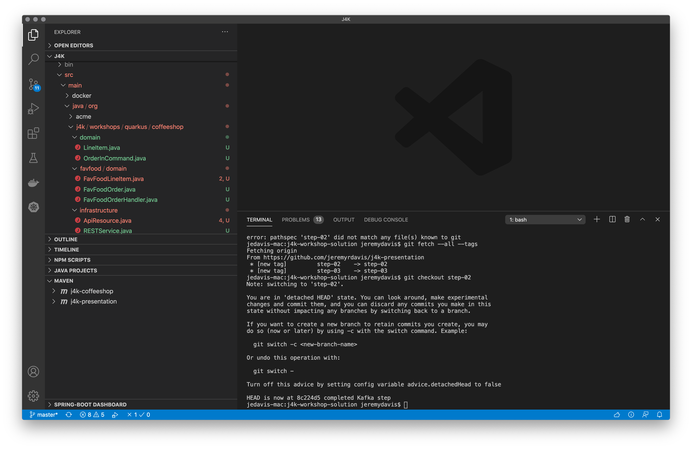

**Event Driven Architecture with Quarkus, Kafka, and Kubernetets**  

# Step 3 - Apache Kafka and Reactive Messaging

## Adding Kafka

In this step we are going to swap out our REST call by directly sending the order to the "orders" Kafka Topic used by the Quarkus Coffeeshop application.

In this workshop you will build a microservice to integrate the existing Quarkus Coffeeshop application with the FavFood Delivery Service

If you have cloned the "j4k-workshop-solution" project you can check a tag that corresponds to this step with the following command:

```shellscript

git checkout step-02

```



### Kakfa Topics

:sunglasses" *Kafka Topics in an Event Driven Architecture Tip:* Keep related events in the same topic.  We have multiple topics in the application, which is really easy and incurs essentially no performance hit with Kafka.  However, we send all order related events to the the "orders" topic.  This makes it easy to reconstruct our timeline ~~if~~ when we need to debug or replay events in the future.

### SmallRye Reactive Messaging

We mentioned  in the last section.  The SmallRye project has multiple sub-projects.   is the one we will be using to interact with Kafka because it makes interacting with Kafka really easy!

In an unrelated side note, Clement Escoffier, @clementplop, another one of the guys whose picture is on the Quarkus Coffeeshop website, is Red Hat's Chief Architect for all things reactive, leads our SmallRye Reactive Messaging implementation, and created the demo upon which this application is based.

## Add Kafka to our application

First we need to add SmallRye Reactive Messaging and 2 dependencies that will help us test Kafka:


### Add the Kafka dependencies to our pom.xml

```xml
 <dependency>
    <groupId>io.quarkus</groupId>
    <artifactId>quarkus-smallrye-reactive-messaging-kafka</artifactId>
 </dependency>
 <dependency>
    <groupId>io.quarkus</groupId>
    <artifactId>quarkus-test-common</artifactId>
</dependency>
<dependency>
      <groupId>org.testcontainers</groupId>
      <artifactId>kafka</artifactId>
      <version>1.15.0-rc2</version>
</dependency>
```

### Add the Kafka configuration to our application.properties

application.properties:

```properties
# Kafka
%dev.mp.messaging.outgoing.orders.connector=smallrye-kafka
%dev.mp.messaging.outgoing.orders.value.serializer=org.apache.kafka.common.serialization.StringSerializer
%dev.mp.messaging.outgoing.orders.topic=orders

%test.mp.messaging.outgoing.orders.connector=smallrye-kafka
%test.mp.messaging.outgoing.orders.value.serializer=org.apache.kafka.common.serialization.StringSerializer
%test.mp.messaging.outgoing.orders.topic=orders
```

## Testing with the QuarkusTestResourceLifecycleManager

Create a class QuarkusTestResource class to start Kafka before our JUnit test runs:

```java
import io.quarkus.test.common.QuarkusTestResourceLifecycleManager;
import org.testcontainers.containers.KafkaContainer;

import java.util.Collections;
import java.util.Map;

public class KafkaTestResource implements QuarkusTestResourceLifecycleManager {

    private final KafkaContainer kafkaContainer = new KafkaContainer();

    @Override
    public Map<String, String> start() {
        kafkaContainer.start();
        return Collections.singletonMap("kafka.bootstrap.servers", kafkaContainer.getBootstrapServers());
    }

    @Override
    public void stop() {
        kafkaContainer.stop();
    }
}
```

And add the new class to our ApiResourceTest class:

```java
@QuarkusTest @QuarkusTestResource(KafkaTestResource.class)
public class ApiResouceTest {

    Logger logger = LoggerFactory.getLogger(ApiResourceTest.class);

```

```java
package org.j4k.workshops.quarkus.coffeeshop.favfood;

import io.quarkus.test.common.QuarkusTestResource;
import io.quarkus.test.junit.QuarkusTest;
import io.quarkus.test.junit.mockito.InjectMock;
import org.j4k.workshops.quarkus.coffeeshop.infrastructure.KafkaTestResource;
import org.j4k.workshops.quarkus.coffeeshop.infrastructure.RESTService;
import org.junit.jupiter.api.Test;
import org.slf4j.Logger;
import org.slf4j.LoggerFactory;

import javax.json.Json;
import javax.json.JsonArray;
import javax.json.JsonArrayBuilder;
import javax.json.JsonObject;
import javax.ws.rs.core.MediaType;
import java.util.UUID;

import static io.restassured.RestAssured.given;
import static org.hamcrest.CoreMatchers.equalTo;
import static org.hamcrest.CoreMatchers.is;

@QuarkusTest @QuarkusTestResource(KafkaTestResource.class)
public class FavFoodOrderTest {

    Logger logger = LoggerFactory.getLogger(FavFoodOrderTest.class);

    @Test
    public void testPlacingOrder() {

    final String json = "{\"customerName\":\"Lemmy\",\"orderId\":\"cdc07f8d-698e-43d9-8cd7-095dccace575\",\"favFoodLineItems\":[{\"item\":\"COFFEE_BLACK\",\"itemId\":\"0eb0f0e6-d071-464e-8624-23195c8f9e37\",\"quantity\":1}]}";

    @Test
    public void tetFavFoodEndpoint(){

        given()
                .when()
                .contentType(MediaType.APPLICATION_JSON)
                .accept(MediaType.APPLICATION_JSON)
                .body(json)
                .post("/api/favfood")
                .then()
                .statusCode(202);
    }
}
```

### Run the test

## Create a Kafka service:

```java
package org.j4k.workshops.quarkus.coffeeshop.infrastructure;

import org.eclipse.microprofile.reactive.messaging.Channel;
import org.eclipse.microprofile.reactive.messaging.Emitter;
import org.j4k.workshops.quarkus.coffeeshop.domain.OrderInCommand;
import org.slf4j.Logger;
import org.slf4j.LoggerFactory;

import javax.enterprise.context.ApplicationScoped;
import javax.inject.Inject;
import javax.json.bind.Jsonb;
import javax.json.bind.JsonbBuilder;
import java.util.concurrent.CompletableFuture;

@ApplicationScoped
public class KafkaService {

    Logger logger = LoggerFactory.getLogger(KafkaService.class);

    Jsonb jsonb = JsonbBuilder.create();

    @Inject
    @Channel("orders")
    Emitter<String> ordersEmitter;

    public CompletableFuture<Void> placeOrders(OrderInCommand orderInCommand) {

        logger.debug("sending {}", orderInCommand);
        return ordersEmitter.send(jsonb.toJson(orderInCommand)).toCompletableFuture();
    }
}
```

### Wire our KafkaService into our REST endpoint

```java
package org.j4k.workshops.quarkus.coffeeshop.infrastructure;

import org.j4k.workshops.quarkus.coffeeshop.domain.FavFoodOrder;
import org.j4k.workshops.quarkus.coffeeshop.domain.OrderInCommand;
import org.j4k.workshops.quarkus.coffeeshop.favfood.domain.FavFoodOrderHandler;
import org.slf4j.Logger;
import org.slf4j.LoggerFactory;

import javax.inject.Inject;
import javax.ws.rs.POST;
import javax.ws.rs.Path;
import javax.ws.rs.core.Response;

@Path("/api")
public class ApiResource {

    Logger logger = LoggerFactory.getLogger(ApiResource.class);

    @Inject
    KafkaService kafkaService;

    @POST
    @Path("/favfood")
    public Response acceptFavFoodOrder(final FavFoodOrder favFoodOrder) {

        logger.debug("received {}", favFoodOrder);

        OrderInCommand orderInCommand = FavFoodOrderHandler.handleOrder(favFoodOrder);

        logger.debug("sending {}", orderInCommand);
        kafkaService.placeOrders(orderInCommand);

        return Response.accepted(favFoodOrder).build();
    }
}
```
